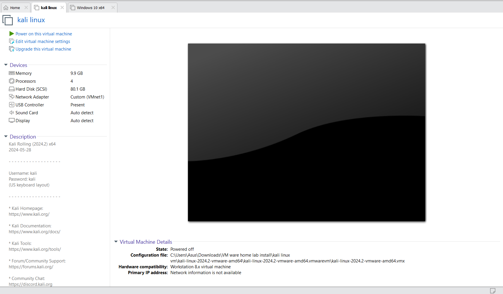
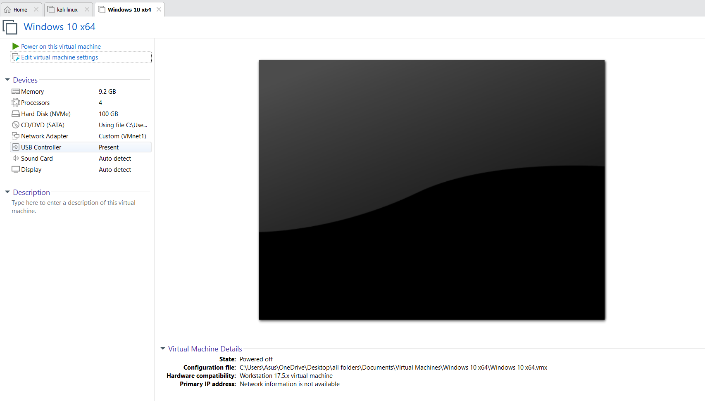

# 👨‍💻SOC Home Lab: Attack & Defense Simulation 🚀

---
## Table of Contents

1.  [Introduction](#introduction)
2.  [Prerequisites](#prerequisites)
3.  [Network Topology](#network-topology)
4.  [Step 1: Setting Up Virtual Machines](#step-1-setting-up-virtual-machines)
    * [1.1 Install Kali Linux (Attacker Machine)](#11-install-kali-linux-attacker-machine)
    * [1.2 Install Windows 10 (Target Machine)](#12-install-windows-10-target-machine)
    * [1.3 Configure Network Adapters](#13-configure-network-adapters)
    * [1.4 Set Static IP Addresses](#14-set-static-ip-addresses)
5.  [Step 2: Installing Splunk for Log Monitoring](#step-2-installing-splunk-for-log-monitoring)
6.  [Step 3: Installing Sysmon on Windows 10](#step-3-installing-sysmon-on-windows-10)
7.  [Step 4: Generating Malware with msfvenom](#step-4-generating-malware-with-msfvenom)
8.  [Step 5: Setting Up a Metasploit Listener](#step-5-setting-up-a-metasploit-listener)
9.  [Step 6: Monitoring Logs with Splunk](#step-6-monitoring-logs-with-splunk)
10. [Troubleshooting](#troubleshooting)
11. [Next Steps & Future Improvements](#next-steps--future-improvements)
12. [How to Contribute](#how-to-contribute)
13. [Conclusion](#conclusion)

---
## 📌Introduction
This project demonstrates the setup of a home lab environment for cybersecurity testing, including an attack machine (Kali Linux), a target machine (Windows 10 VM), and a logging system (Splunk) to monitor malicious activities. The project involves:

- Setting up isolated virtual machines.

- Installing and configuring Sysmon for comprehensive log collection.

- Generating and deploying malware using msfvenom.

- Monitoring attacks using Splunk for analysis and detection.

Note: This lab is for educational purposes only. All activities should be conducted in a strictly isolated environment to prevent any unauthorized access or damage to your personal network or data. Do not use these techniques for unauthorized activities.

---
## 🔧 Prerequisites

| Requirement           | Description                                                                 |
| :-------------------- | :-------------------------------------------------------------------------- |
| RAM                   | At least 16GB (to comfortably run multiple VMs simultaneously).             |
| Virtualization Software | VMware Workstation (Pro/Player) or VirtualBox. Ensure you are familiar with basic VM operations. |
| Operating Systems     | ISO files for Windows 10 (a non-N edition is generally recommended for broader compatibility) and Kali Linux. |   
| Logging Tools         | Splunk Enterprise (Free/Trial version for home lab) and Sysmon setup files, along with a pre-configured `sysmonconfig.xml`. |
| Internet Connection   | Required for downloading ISOs, tools, updates, and configuration files.     |
| Disk Space            | At least 100GB of free disk space for VM images and logs.                   |

---
### Network Topolog

Below is a simple network topology illustrating the setup. For optimal lab isolation and communication, it's highly recommended to configure your Virtual Machines with **Host-Only network adapters (VMnet1)**. This ensures they can communicate with each other while being completely isolated from your main home network, which is crucial for security when experimenting with malware.


The Kali Linux machine initiates attacks against the Windows 10 VM. Logs generated by Sysmon on the Windows machine are collected by Splunk running on the Host machine via the Host-Only network for analysis and detection of malicious activities.git

---

## Step 1: Setting Up Virtual Machines

Before starting, ensure you have your chosen virtualization software (VMware Workstation or VirtualBox) installed and updated.

### 1.1 Install Kali Linux (Attacker Machine)

1.  **Download Kali Linux ISO:** Obtain the latest version from the [Kali Official Website](https://www.kali.org/downloads/).
2.  **Create a New VM:**
    * Open your virtualization software (VMware Workstation).
    * Choose to create a new virtual machine.
    * Select "Installer disc image file (ISO)" and point to your downloaded Kali Linux ISO.
    * Follow the on-screen prompts for installation. Choose a username and password.
    * **Allocate at least 4GB RAM and 2 CPU cores** to the Kali VM.
    * Set the hard disk size to at least 40GB.
    * **After initial setup and network adapter configuration (covered in 1.3):**
      
3.  **Update and Upgrade Kali:** After installation, log in and open a terminal.
    ```bash
    sudo apt update && sudo apt upgrade -y
    ```
    This ensures all packages are up-to-date.

### 1.2 Install Windows 10 (Target Machine)

1.  **Download Windows 10 ISO:** Download the Media Creation Tool from [Microsoft's website](https://www.microsoft.com/en-us/software-download/windows10ISO) to create a Windows 10 ISO.
2.  **Create a New VM:**
    * Create a new virtual machine in your virtualization software.
    * Select "Installer disc image file (ISO)" and point to your downloaded Windows 10 ISO.
    * Follow the installation wizard. You can skip entering a product key for a trial period. Choose Windows 10 Pro for this lab.
    * **Allocate at least 8GB RAM and 2-4 CPU cores** to the Windows 10 VM.
    * Set the hard disk size to at least 60GB.
    * **After initial setup and network adapter configuration (covered in 1.3):**
      
3.  **Disable Windows Defender (Temporarily for testing):** Go to `Settings` > `Update & Security` > `Windows Security` > `Virus & threat protection` > `Manage settings` and turn off "Real-time protection." This is necessary for the malware simulation to work effectively in a controlled lab. Remember to re-enable it or use an EDR/AV solution in a production environment.
4.  **Install VMware Tools / VirtualBox Guest Additions:** This will improve performance and enable features like drag-and-drop file transfer, which can be useful for deploying the payload.